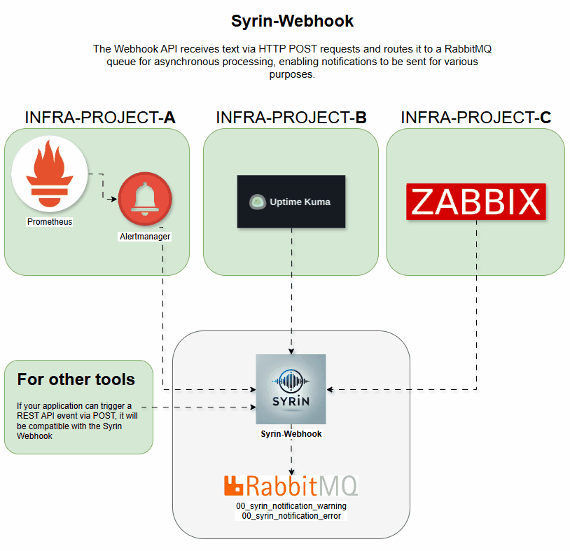

# syrin-webhook

The `syrin-webhook` is a Flask-based service that receives text messages or alerts and sends them to a RabbitMQ queue for further processing. It is specifically designed to handle messages from different sources such as Alertmanager and uptime-kuma.

## Demo



## Table of Contents
- [Installation](#installation)
- [Environment Variables](#environment-variables)
- [Endpoints](#endpoints)
- [Queue Declarations](#queue-declarations)
- [Logging](#logging)
- [Contributing](#contributing)
- [License](#license)

## Installation

To set up this service, you need to configure RabbitMQ and deploy the service using Kubernetes or Docker Compose. For full installation instructions, please refer to the [SYRIN Installation Repository](https://github.com/syrin-alert/syrin-install).

## Environment Variables

This service requires the following environment variables to configure RabbitMQ connection details:

- `RABBITMQ_HOST`: Host address of RabbitMQ server.
- `RABBITMQ_PORT`: Port of RabbitMQ server (default: `5672`).
- `RABBITMQ_VHOST`: Virtual host on RabbitMQ.
- `RABBITMQ_USER`: Username for RabbitMQ authentication.
- `RABBITMQ_PASS`: Password for RabbitMQ authentication.

These variables should be defined in your environment before running the application.

## Endpoints

### `POST /api/text-to-speech`

#### Description
Receives a JSON payload with alert data or text messages. It supports two primary types of payloads:

1. **Alertmanager Alerts**: Processes multiple alerts, extracting fields such as `description`, `namespace`, and `severity`.
2. **Custom Text Messages**: Accepts custom messages from sources like uptime-kuma.

#### Payload Format

**Alertmanager Alert Payload**:

```json
{
  "alerts": [
    {
      "labels": {
        "cluster": "CLUSTER_NAME",
        "namespace": "NAMESPACE",
        "severity": "warning or error"
      },
      "annotations": {
        "description": "Detailed alert description"
      }
    }
  ]
}
```

**Custom Text Message**:

```json
{
  "text": "Your custom message here"
}
```

or

```json
{
  "msg": "Uptime-kuma alert message here"
}
```

#### Response

- **Success (200)**: Alerts or messages are accepted and queued for processing.
  - Example: `{"message": "Alerts from Alertmanager processed successfully"}`
- **Error (400)**: Required fields are missing in the payload.
  - Example: `{"error": "No text or message provided"}`

## Queue Declarations

The following RabbitMQ queues are created upon service startup:

- `00_syrin_notification_warning`: For warning-level messages.
- `00_syrin_notification_error`: For error-level messages.

Each message is delivered to the corresponding queue based on its severity level.

## Logging

Logging is configured at the INFO level, with `pika` library logs set to WARNING to reduce verbosity.

## Contributing

Feel free to contribute by opening issues or submitting pull requests.

## License

This project is licensed under the MIT License.
