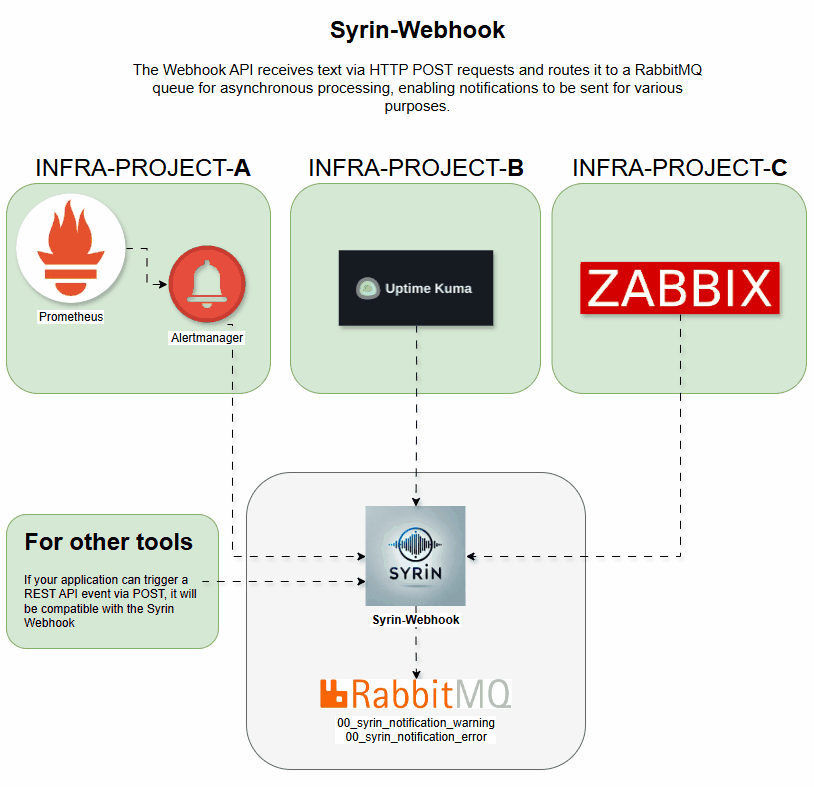

# syrin-webhook

O `syrin-webhook` é um serviço baseado em Flask que recebe mensagens de texto ou alertas e os envia para uma fila do RabbitMQ para processamento posterior. Ele é projetado especificamente para lidar com mensagens de diferentes fontes, como Alertmanager e uptime-kuma.

## Demo



## Tabela de Conteúdos
- [Instalação](#instalação)
- [Variáveis de Ambiente](#variáveis-de-ambiente)
- [Endpoints](#endpoints)
- [Declarações de Filas](#declarações-de-filas)
- [Logs](#logs)
- [Contribuição](#contribuição)
- [Licença](#licença)

## Instalação

Para configurar este serviço, você precisa configurar o RabbitMQ e implantar o serviço usando Kubernetes ou Docker Compose. Para instruções completas de instalação, consulte o [Repositório de Instalação do SYRIN](https://github.com/syrin-alert/syrin-install).

## Variáveis de Ambiente

Este serviço requer as seguintes variáveis de ambiente para configurar os detalhes de conexão do RabbitMQ:

- `RABBITMQ_HOST`: Endereço do servidor RabbitMQ.
- `RABBITMQ_PORT`: Porta do servidor RabbitMQ (padrão: `5672`).
- `RABBITMQ_VHOST`: Virtual host no RabbitMQ.
- `RABBITMQ_USER`: Nome de usuário para autenticação no RabbitMQ.
- `RABBITMQ_PASS`: Senha para autenticação no RabbitMQ.

Essas variáveis devem ser definidas no seu ambiente antes de executar a aplicação.

## Endpoints

### `POST /api/text-to-speech`

#### Descrição
Recebe um payload JSON com dados de alerta ou mensagens de texto. Ele suporta dois tipos principais de payloads:

1. **Alertas do Alertmanager**: Processa múltiplos alertas, extraindo campos como `description`, `namespace` e `severity`.
2. **Mensagens de Texto Personalizadas**: Aceita mensagens personalizadas de fontes como uptime-kuma.

#### Formato do Payload

**Payload de Alerta do Alertmanager**:

```json
{
  "alerts": [
    {
      "labels": {
        "cluster": "NOME_DO_CLUSTER",
        "namespace": "NAMESPACE",
        "severity": "warning ou error"
      },
      "annotations": {
        "description": "Descrição detalhada do alerta"
      }
    }
  ]
}
```

**Mensagem de Texto Personalizada**:

```json
{
  "text": "Sua mensagem personalizada aqui"
}
```

ou

```json
{
  "msg": "Mensagem de alerta do uptime-kuma aqui"
}
```

#### Respostas

- **Sucesso (200)**: Alertas ou mensagens são aceitos e colocados em fila para processamento.
  - Exemplo: `{"message": "Alertas do Alertmanager processados com sucesso"}`
- **Erro (400)**: Campos obrigatórios estão ausentes no payload.
  - Exemplo: `{"error": "Nenhum texto ou mensagem fornecida"}`

## Declarações de Filas

As seguintes filas do RabbitMQ são criadas ao iniciar o serviço:

- `00_syrin_notification_warning`: Para mensagens de nível de aviso (warning).
- `00_syrin_notification_critical`: Para mensagens de nível de erro (error).

Cada mensagem é enviada para a fila correspondente com base no seu nível de severidade.

## Logs

A configuração de logs é definida no nível INFO, com os logs da biblioteca `pika` definidos para WARNING para reduzir a verbosidade.

## Contribuição

Sinta-se à vontade para contribuir abrindo issues ou enviando pull requests.

## Licença

Este projeto está licenciado sob a Licença MIT.
